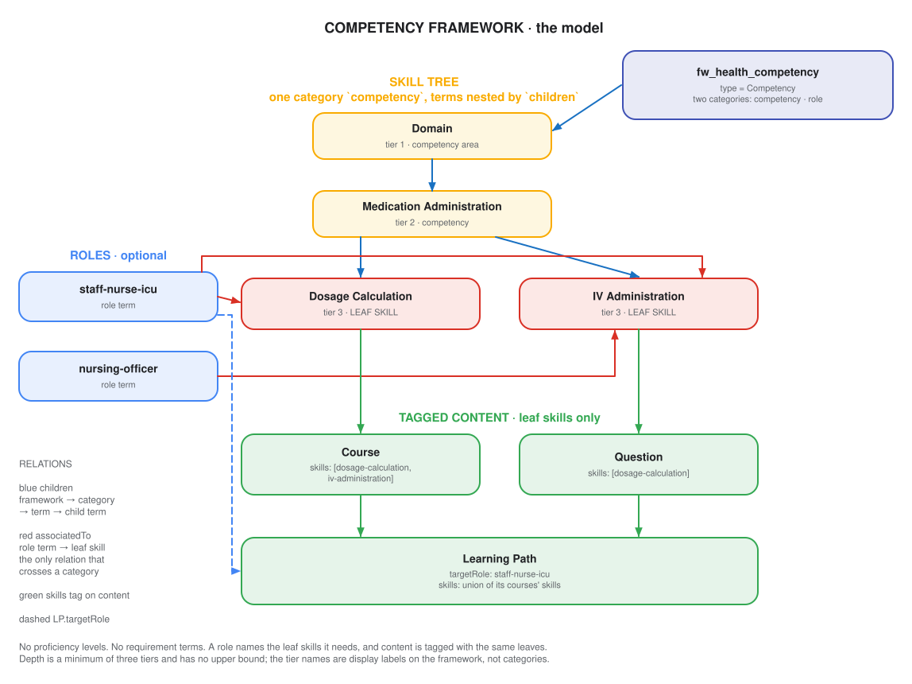
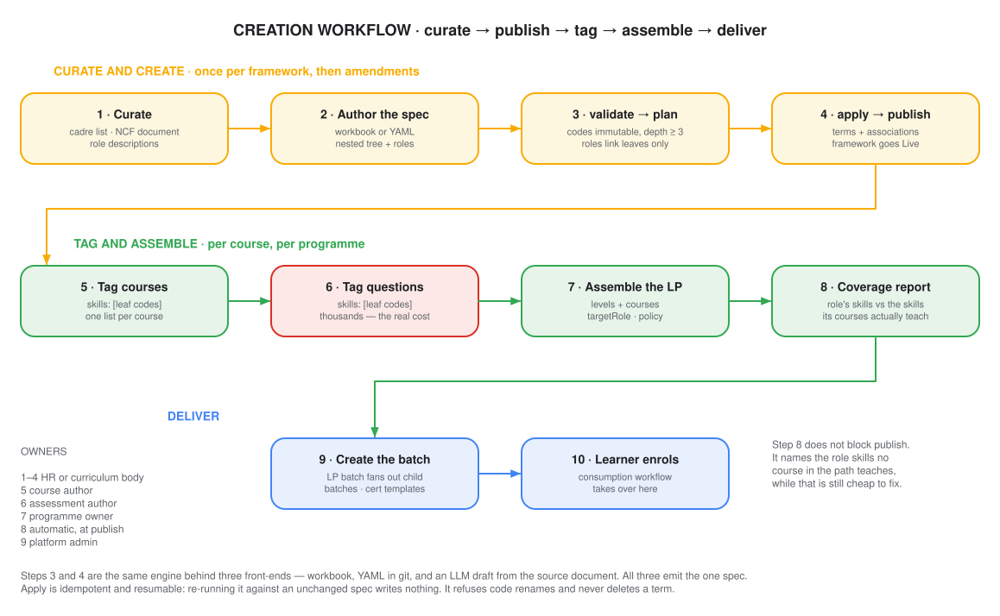
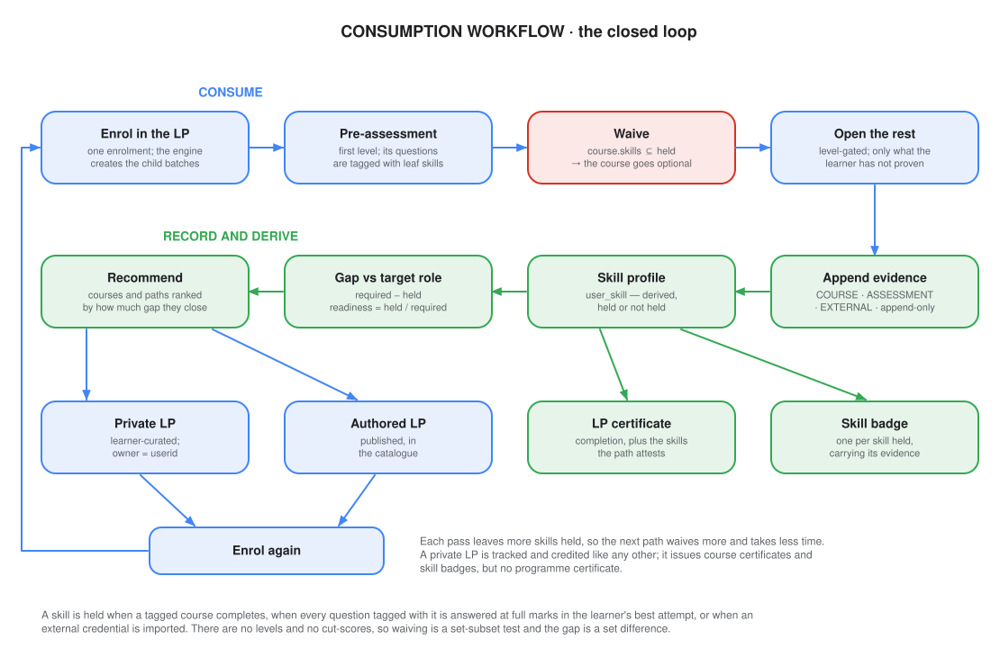

# Competency framework — design

## Summary

A competency framework is one nested skill tree, plus optional roles. Courses and questions are
tagged with the tree's leaf skills. Completing a tagged course, or answering a skill's questions at
full marks, records that skill against the learner. What the learner holds, set against what a role
needs, drives the next path.

## Highlights

| Aspect | Position |
|---|---|
| Framework objects | Two categories — `competency` (nested terms) and `role` (optional) |
| Hierarchy | Minimum three tiers, no upper bound. Tier names are display labels on the framework, not categories |
| Tagging point | Leaf terms only. Courses, questions and roles all link the same leaves |
| Proficiency levels | None. A skill is held or not held |
| Attainment | Course completion, full marks on the skill's tagged questions, or an external import |
| Learner record | `user_skill_evidence` append-only, `user_skill` derived and rebuildable |
| Expiry | None. An attained skill is permanent |
| Knowlg change | One enum value — `type = "Competency"` on the framework schema |
| Learner-created paths | A private LP, owned by the learner, seeded from the recommendation |

## Design decisions

| Decision | Reason |
|---|---|
| One `competency` category, terms nested by `children` | Grouping and decomposition are the same relation. A second mechanism for it earns nothing |
| Three tiers minimum, no maximum, by depth rather than by category | A framework grows a tier by nesting deeper, so depth is an authoring choice and not a schema change |
| Only leaf terms are tagged | The thing a course teaches, a question measures and a role requires is one object. One tagging point removes the question of which tier to tag |
| No proficiency scale | A scale has to be authored, tuned and explained per framework before a single skill can be credited, and every reader of the profile then has to reason about levels |
| Binary attainment | Full marks on a skill's questions, or completion of a course that teaches it. The progression engine already computes both |
| Roles associate leaf skills directly, with no requirement object between them | A requirement object costs roles × skills authored terms — 1k to 20k for a framework of 200 skills — to say what a list of codes says |
| Roles are optional | A platform with a single audience has nothing to compare a learner against, and should not have to author a role to use the tree |
| No expiry | It would be the only scheduled component in the design, and it serves one of the three use cases. See *Open questions* |
| A role's skill list is cached, not stored | It is framework data of the same size and volatility as the tree it points at, so a table would be a second authority on it |
| `skills` on content is a flat array of codes | A flat array filters in Elasticsearch without a nested query, so no denormalised mirror field is needed |
| The learner record splits into an append-only ledger and a derived projection | A retagged course or a corrected mapping can be replayed over history without asking learners to redo anything |

## The model

Three objects. The first two are framework configuration; the third is the only thing written per
learner.

| Object | What it is | Where it lives | Cardinality |
|---|---|---|---|
| **Skill tree** | One `competency` category whose terms nest by `children`. Leaves are the skills | Knowlg framework | 3+ tiers, 200–2000 leaves |
| **Role** | A named set of leaf skills — a job post, a grade, a career track | Knowlg framework, `role` category | 0–500 |
| **Evidence** | A dated, attributed record that a learner holds a leaf skill | lern-service, append-only | Per learner, per skill |



Editable source: [`competency-model-v2.excalidraw`](competency-model-v2.excalidraw) — open at
excalidraw.com or with the VS Code Excalidraw extension. Re-export the SVG after any edit.

### Hierarchy rules

| Rule | Statement | Enforced at |
|---|---|---|
| Depth | Three tiers minimum, no maximum. A framework grows a tier by nesting deeper | Spec validation |
| Tier names | `tierLabels` on the framework, e.g. `[Competency area, Competency, Skill]`. Display only | — |
| Leaf | A term with no children. Nothing else is tagged | Spec validation |
| One relation inside the tree | `children` / `parents` (`hasSequenceMember`) | Term schema |
| One relation out of the tree | `role` term → leaf terms (`associations` / `associatedTo`) | Term schema |
| Uniform leaf depth is not required | One branch may stop at tier 3 while another goes to tier 4 | — |
| Codes are immutable | A rename changes the label, never the code | Spec validation |
| Terms are retired, never deleted | Evidence rows point at them | Spec validation |

Non-leaf terms are for navigation and reporting. They are never tagged, never required by a role and
never held by a learner, so no rollup rule is needed to make them attainable.

### What gets tagged

| Object | Field | Type | Means |
|---|---|---|---|
| Question | `skills` | `array<text>` | Full marks on every question carrying this skill is evidence of it |
| Course | `skills` | `array<text>` | Completing this course records these skills |
| Learning Path | `skills` | `array<text>` | The union of its courses' skills; written at publish |
| Learning Path | `targetRole` | `text` | The role the programme is built for. Drives the coverage report and the gap |
| Course, Question, LP | `competencyFramework` | `text` | Which framework the codes belong to. Distinct from `framework`, which is the taxonomy |

### The one Knowlg change

`schemas/framework/1.0/schema.json` constrains `type` to `["K-12", "TPD"]`. Add `"Competency"`, so a
competency framework is distinguishable from a taxonomy framework. Everything else — the two master
categories, their terms, the associations — is data created through the existing framework and term
APIs.

## Curation — three use cases on one shape

### State health department

`fw_health_competency` · `tierLabels: [Competency area, Competency, Skill]` · three tiers.

| Competency area | Competency | Leaf skills |
|---|---|---|
| Domain | Medication Administration | `dosage-calculation` · `iv-administration` · `medication-reconciliation` |
| Domain | Infection Prevention | `hand-hygiene` · `ppe-use` · `sterile-field` |
| Domain | Neonatal Care | `neonatal-resuscitation` · `newborn-assessment` |
| Functional | Public Financial Management | `budget-preparation` · `expenditure-monitoring` |
| Functional | Health Data | `register-maintenance` · `hmis-reporting` |
| Behavioural | Communication | `patient-counselling` · `breaking-bad-news` |
| Behavioural | Leadership | `team-briefing` · `roster-management` |

Roles, drawing on one shared leaf pool:

| Leaf skill | Staff Nurse (ICU) | Nursing Officer | Deputy Secretary (Health) |
|---|---|---|---|
| `dosage-calculation` | ✓ | ✓ | - |
| `iv-administration` | ✓ | ✓ | - |
| `medication-reconciliation` | - | ✓ | - |
| `hand-hygiene` | ✓ | ✓ | - |
| `ppe-use` | ✓ | ✓ | - |
| `sterile-field` | ✓ | ✓ | - |
| `neonatal-resuscitation` | ✓ | - | - |
| `patient-counselling` | ✓ | ✓ | - |
| `team-briefing` | - | ✓ | ✓ |
| `roster-management` | - | ✓ | ✓ |
| `hmis-reporting` | ✓ | ✓ | ✓ |
| `budget-preparation` | - | - | ✓ |
| `expenditure-monitoring` | - | - | ✓ |
| **Required count** | **8** | **10** | **5** |

Three roles, 16 leaf skills, 23 associations — and no scale, no required level and no requirement
objects to author alongside them.

### School education platform

`fw_ncf_outcomes` · `tierLabels: [Subject area, Competency, Skill, Sub-skill]` · four tiers, because
a learning outcome decomposes one step further than a clinical skill.

| Subject area | Competency | Skill | Leaf sub-skills |
|---|---|---|---|
| Numeracy | Number Sense | Integers | `int-order` · `int-number-line` |
| Numeracy | Number Sense | Fractions | `fr-compare` · `fr-add-unlike` |
| Numeracy | Number Sense | Ratio | `ra-express` · `ra-solve` |
| Numeracy | Algebraic Thinking | Patterns | `pat-extend` · `pat-describe` |
| Numeracy | Algebraic Thinking | Equations | `eq-one-step` |
| Numeracy | Spatial Reasoning | Measurement | `me-perimeter` · `me-area` |

The taxonomy framework `fw_state_k12` — `board`, `medium`, `gradeLevel`, `subject` — is untouched and
still drives the catalogue. Role terms reuse the `gradeLevel` codes, so a learner whose profile
already carries `gradeLevel = grade-6` needs no new data entry.

Role `grade-6` requires all eleven leaves above. Role `grade-7` requires that same set, plus
`fr-multiply`, `eq-two-step`, `ra-proportion` and `me-volume`. A child arriving in Grade 7 with the
Grade 6 skills held has them waived rather than retaught — the grade spiral as set containment.

### Software skills platform

`fw_tech_skills` · `tierLabels: [Competency area, Competency, Skill]` · three tiers. Leaves are
written as actions, which is what makes the badge legible to an employer.

| Competency area | Competency | Leaf skills |
|---|---|---|
| Cloud | Container Orchestration | `k8s-deployment-manifest` · `k8s-autoscaling` · `k8s-debug-crashloop` |
| Cloud | Infrastructure as Code | `tf-module-authoring` · `tf-state-management` |
| Data | Pipeline Engineering | `batch-etl-authoring` · `stream-processing` · `data-quality-checks` |
| Backend | API Design | `rest-contract-design` · `pagination-and-filtering` · `idempotent-writes` |
| Security | Application Security | `authz-model-design` · `secret-management` |

| Role (career track) | Leaf skills required |
|---|---|
| Backend Engineer | `rest-contract-design` · `pagination-and-filtering` · `idempotent-writes` · `authz-model-design` · `secret-management` |
| SRE | `k8s-deployment-manifest` · `k8s-autoscaling` · `k8s-debug-crashloop` · `tf-module-authoring` · `tf-state-management` · `secret-management` |
| Data Engineer | `batch-etl-authoring` · `stream-processing` · `data-quality-checks` · `tf-module-authoring` |

### What varies

| Dimension | Health | School | Software |
|---|---|---|---|
| Tiers | 3 | 4 | 3 |
| Roles | Job posts | Grades, codes reused from the taxonomy | Career tracks |
| Who sets the learner's role | HR or personnel feed | Derived from the profile's `gradeLevel` | The learner |
| Current role | Assigned | Derived | None, target only |
| Dominant evidence | Assessment plus imported credentials | Assessment | Assessment |
| Private LPs | Occasional | Not used | The main entry point |
| Certificates that matter | LP certificate | LP certificate as a term report | Skill badges |
| Objects, tables, APIs, attainment rules | identical | identical | identical |

Every difference is configuration or a field left null.

## Creation workflow



Editable source: [`competency-creation-v2.excalidraw`](competency-creation-v2.excalidraw)

| Step | Owner | Output | Volume | Frequency |
|---|---|---|---|---|
| 1 · Curate | HR or curriculum body | Cadre list, outcome document, role descriptions | 1 source | Once |
| 2 · Author the spec | Same | One workbook or YAML file | 200–2000 leaves, 0–500 roles | Once, then amendments |
| 3 · `validate` → `plan` | Platform admin | A diff against the live framework | - | Per amendment |
| 4 · `apply` → publish | Platform admin | Terms and associations, framework Live | - | Per amendment |
| 5 · Tag courses | Course author | `skills` on the course | 1 list per course | Per course |
| 6 · Tag questions | Assessment author | `skills` on each question | Thousands | Per question set |
| 7 · Assemble the LP | Programme owner | Levels, courses, `targetRole`, `policy` | Per programme | Per programme |
| 8 · Coverage report | Automatic, at publish | Covered and uncovered role skills | - | Per publish |
| 9 · Create the batch | Platform admin | LP batch, child batches, certificate templates | Per cohort | Per cohort |

Step 6 is the cost. Framework creation is a day's work; tagging a published question bank is not.

### The spec

One artefact, three front-ends — a workbook, YAML in git, and an LLM draft from the source document.
All three emit the same file, and only the engine talks to Knowlg.

```yaml
spec: competency/v1
framework:
  id: fw_health_competency
  name: State Health Department Competency Framework
  type: Competency
  channel: ch_health_dept
  tierLabels: [Competency area, Competency, Skill]

tree:                                 # one branch shown; the rest follows the table above
  - code: domain
    name: Domain
    children:
      - code: medication-administration
        name: Medication Administration
        children:
          # no children of their own ⇒ leaves ⇒ the only taggable terms
          - { code: dosage-calculation,        name: Dosage Calculation }
          - { code: iv-administration,         name: IV Administration }
          - { code: medication-reconciliation, name: Medication Reconciliation }

roles:                                # leaf codes only; `plan` fails on a non-leaf
  - code: staff-nurse-icu
    name: Staff Nurse (ICU)
    skills: [dosage-calculation, iv-administration, hand-hygiene, ppe-use,
             sterile-field, neonatal-resuscitation, patient-counselling, hmis-reporting]

retired: []                           # explicit; absence from `tree` is never a retirement
```

### Rules the engine enforces

| Rule | Behaviour on violation |
|---|---|
| `tree` is at least three levels deep | `plan` fails |
| Every code in `roles[].skills` resolves to a leaf | `plan` fails, naming the non-leaf codes |
| Codes are immutable | `plan` fails on any name-to-code remap |
| Terms are retired, never deleted | Absence from `tree` is ignored; retirement needs an explicit `retired` entry |
| Codes are unique across the whole tree | `plan` fails |
| `apply` is idempotent and resumable | Re-running against an unchanged spec writes nothing |

### Coverage report

Computed at LP publish against `targetRole`. Neither check below blocks publish.

| Role skill | Taught by | Verdict |
|---|---|---|
| `dosage-calculation` | Safe Medication Practice | Covered |
| `iv-administration` | Safe Medication Practice | Covered |
| `hand-hygiene` | Infection Prevention in Critical Care | Covered |
| `ppe-use` | Infection Prevention in Critical Care | Covered |
| `sterile-field` | Infection Prevention in Critical Care | Covered |
| `neonatal-resuscitation` | Neonatal Resuscitation Basics | Covered |
| `patient-counselling` | Communicating with Patients and Families | Covered |
| `hmis-reporting` | - | **Not covered** |

Alongside coverage, the report warns on assessability: a skill the path claims but no question in
it is tagged with can only ever be completion-derived.

## Consumption workflow



Editable source: [`competency-consumption-v2.excalidraw`](competency-consumption-v2.excalidraw)

### Attainment

| Source | Condition | Records |
|---|---|---|
| `COURSE` | A tagged course reaches completion | Every code in its `skills` |
| `ASSESSMENT` | In the learner's best attempt, every question tagged with the skill scored `score == maxScore` | That skill |
| `EXTERNAL` | An import call maps a credential to leaf skills | Those skills |

| Rule | Statement |
|---|---|
| Held is set membership | Held if at least one non-revoked evidence row exists for that learner and skill |
| Nothing decrements | Revocation is the only way a skill leaves the profile |
| Derived, never accumulated | `user_skill` is a function of the evidence rows. Drop it and rebuild at any time |
| Idempotent | The evidence id is derived from `occurredOn`, `sourceType`, `sourceId` and `batchid`, so a replayed event rewrites the same row instead of adding one |
| Audit | "Why does this nurse hold `iv-administration`?" resolves to a course, a batch and a date |

### Gap and readiness

```
required  = role.skills
held      = { s : an evidence row exists for (learner, s) }

missing   = required − held
readiness = |required ∩ held| / |required|
```

Set arithmetic on two lists of codes. There is no level comparison and no criticality weighting.

### Waiving

A course is waived when `course.skills ⊆ held`. A course with no `skills` is waivable only on prior
completion. Under `PriorLearning` a skill counts however it was acquired — a different course, or a
credential imported from another platform.

Tagging at leaf granularity makes waiving stricter, not looser. A course teaching three leaves is
waived only when all three are held, so a learner who missed one of them still takes it.

### Worked example — an ICU induction path

`do_ICU_Nurse_Induction` · `competencyFramework = fw_health_competency` ·
`targetRole = staff-nurse-icu` · `policy = Adaptive`.

| Level | Contents | `skills` |
|---|---|---|
| 1 | ICU Entry Assessment *(Evaluation Course)* | questions tagged individually |
| 2 | Safe Medication Practice | `dosage-calculation` · `iv-administration` |
| 2 | Infection Prevention in Critical Care | `hand-hygiene` · `ppe-use` · `sterile-field` |
| 3 | Neonatal Resuscitation Basics | `neonatal-resuscitation` |
| 3 | Communicating with Patients and Families | `patient-counselling` |
| 4 | ICU Outcome Assessment *(Evaluation Course)* | questions tagged individually |

Asha is newly posted to ICU. Her role is synced from the personnel feed as `staff-nurse-icu`. She
already holds one skill, imported rather than earned on the platform: `neonatal-resuscitation`, from
an NRP provider card registered as `EXTERNAL` evidence with its issuer recorded.

**Readiness before she starts: 13%** — one of eight required skills.

| Step | Client sends | Server does | Held after |
|---|---|---|---|
| Enrol | `POST /v1/course/enroll {Asha, do_ICU_Nurse_Induction, B}` | LP enrolment, child batches, optionality deferred → opens the entry assessment | unchanged |
| Entry assessment | `assessment/submit` | Per-skill full-marks check: `hand-hygiene` 4/4 · `ppe-use` 3/3 · `patient-counselling` 3/3 · `sterile-field` 3 of 4 · `dosage-calculation` 2 of 5 · `hmis-reporting` 1 of 3. Three evidence rows appended | + `hand-hygiene`, `ppe-use`, `patient-counselling` |
| — | — | Waiving: *Neonatal Resuscitation Basics* `{neonatal-resuscitation} ⊆ held` → **waived**. *Communicating with Patients and Families* `{patient-counselling} ⊆ held` → **waived**. *Infection Prevention* `{hand-hygiene, ppe-use, sterile-field} ⊄ held` → **required**. Level 2 opens with both courses | unchanged |
| Complete Safe Medication Practice | `view/*` on its leaves | Course certificate; `COURSE` evidence for both its skills | + `dosage-calculation`, `iv-administration` |
| Complete Infection Prevention | `view/*` | `COURSE` evidence for all three of its skills | + `sterile-field` |
| Outcome assessment | `assessment/submit` | `hmis-reporting` 3/3 → evidence appended | + `hmis-reporting` |
| LP completes | — | LP certificate naming the eight skills; one skill badge per skill held | — |

**Readiness after: 100%.** Two of four courses were waived, for two different reasons — one because
Asha proved the skill in the entry assessment, one on the strength of a card issued outside the
platform. A third was not waived, because she got one of its three skills wrong.

Her profile is then set against the role she is targeting:

| Nursing Officer requires | Held | Status |
|---|---|---|
| `dosage-calculation` · `iv-administration` | Yes | Met |
| `hand-hygiene` · `ppe-use` · `sterile-field` | Yes | Met |
| `patient-counselling` · `hmis-reporting` | Yes | Met |
| `medication-reconciliation` | - | **Missing** |
| `team-briefing` | - | **Missing** |
| `roster-management` | - | **Missing** |

**Readiness for promotion: 70%.** The recommendation returns the courses and paths covering those
three skills, ranked by how much of the gap each closes and by how little of it the learner
is left to take after waiving.

## Private learning paths

A learner assembles their own path. Two entry points: accept the recommendation as a starting set, or
pick courses from the catalogue.

| Aspect | Authored LP | Private LP |
|---|---|---|
| Owner | Channel | `userid` |
| Visibility | Catalogue | Owner only |
| Created by | Author, through review and publish | Learner, no review, no publish |
| Levels | Authored and ordered | Flat, or ordered by the learner |
| `targetRole` | Set by the author | Inherited from the learner's target role, or none |
| `skills` | Authored | Union of the chosen courses' skills |
| `policy` | `Strict` · `Adaptive` · `PriorLearning` | `PriorLearning` — waives what is already held |
| Batch | Authored, per cohort | Implicit, personal |
| Course certificates | Issue | Issue |
| Skill badges | Issue | Issue |
| LP certificate | Issues | **None** |
| Coverage report | At publish | On demand, against the learner's target role |

No programme certificate, because nobody reviewed the programme. Course certificates, evidence rows
and skill badges are unaffected by who assembled the path.

| Constraint | Reason |
|---|---|
| Cannot be shared or transferred | It is one learner's working set, not a curriculum |
| Cannot contain another LP | Same rule as an authored LP |
| Courses must be Live with an open batch | The engine needs a child batch to enrol into |
| Deleting it does not delete evidence | The evidence points at the course and batch, not the path |
| Counts against the same enrolment limits | It is an ordinary enrolment underneath |

| Method | Path | Purpose |
|---|---|---|
| POST | `/v1/lp/private/create` | Create from a course list, or from `{ targetRole }` to seed it from the gap |
| POST | `/v1/lp/private/update` | Add or remove a course, reorder |
| POST | `/v1/lp/private/read` | The learner's private paths |
| POST | `/v1/lp/private/delete` | Remove the path; evidence and course enrolments survive |

## Learner record and certificates

Three tables, all in the enrolment keyspace so the projector writes where the progression engine
already holds a session.

```cql
-- Append-only. The source of truth. Nothing updates a row except the revoked flag.
CREATE TABLE IF NOT EXISTS sunbird_courses.user_skill_evidence (
  userid       text,
  skillid      text,
  evidenceid   text,          -- "<zero-padded occurred_on>:<digest>"; sorts and dedupes
  framework_id text,
  source_type  text,          -- COURSE | ASSESSMENT | LEARNING_PATH | EXTERNAL
  source_id    text,
  batchid      text,
  score        double,
  max_score    double,
  issuer_id    text,          -- non-null only for EXTERNAL
  note         text,
  occurred_on  timestamp,
  revoked      boolean,
  revoked_reason text,
  PRIMARY KEY ((userid, skillid), evidenceid)
) WITH CLUSTERING ORDER BY (evidenceid DESC);

-- Derived projection. Droppable and rebuildable from the ledger at any time.
CREATE TABLE IF NOT EXISTS sunbird_courses.user_skill (
  userid                text,
  skillid               text,
  framework_id          text,
  source_type           text,
  governing_evidence_id text,
  attained_on           timestamp,
  updated_on            timestamp,
  PRIMARY KEY (userid, skillid)
);

CREATE TABLE IF NOT EXISTS sunbird_courses.user_role (
  userid        text PRIMARY KEY,
  framework_id  text,
  current_role  text,
  target_roles  set<text>,
  source        text,         -- HRMS | PROFILE | SELF
  assigned_on   timestamp
);
```

| Table | Partition choice |
|---|---|
| `user_skill_evidence` | `(userid, skillid)` — the projector's read is exactly one partition |
| `user_skill` | `userid` — a whole profile is one partition read, the hottest query in the design |
| `user_role` | `userid` — read alongside the profile on every gap call |

A row in `user_skill` is the held fact; there is no status column, because there is no state other
than held. Not held is the absence of a row.

The framework itself — the tree and each role's skill list — is an in-memory TTL cache keyed by
framework id, invalidated explicitly on publish rather than stored.

### Existing tables

| Table | Change |
|---|---|
| `user_skills` | Superseded. Its in-repo schema — `sunbird.user_skills(id, userId, skillname, ...)`, `cassandra.cql:488` — sits in a different keyspace, is keyed on `id` and has no collection column, so it is replaced rather than migrated |
| `course_batch` | The certificate template gains a `skills` block. Additive |
| `user_enrolments` | No change. `optional_nodes` and `optionality_computed` are unchanged; only the predicate that fills them changes |

### Certificates

| Grain | Issued when | Attests |
|---|---|---|
| Course certificate | The course completes | Participation and completion. Unchanged |
| LP certificate | All required courses complete | Completion, plus the skills the path attests |
| Skill badge | A skill is first recorded | That one skill, with the evidence that proved it |

The badge decouples recognition from programme structure: a learner who picks up a skill through a
standalone course, a private LP or an imported credential still gets something portable.

| Open Badges 3.0 concept | This design |
|---|---|
| `Achievement` | A leaf skill |
| `alignment` | The skill term's identifier in the published framework |
| `criteria` | The attainment rule that applied — completion, full marks, or an import |
| `evidence` | The evidence rows that supported it: source, batch, score, date |
| Revocation | The `revoked` flag. Revoking evidence reprojects the profile and revokes the badge |

Signing verifiable credentials stays with the certificate service. This design's obligation is to
hand it a complete achievement object instead of a name and a course title.

## APIs

| Method | Path | Purpose | Auth |
|---|---|---|---|
| POST | `/v1/skill/profile/read` | Skills held, optionally with evidence expanded | Self, or supervisor |
| POST | `/v1/skill/gap/read` | Missing skills and readiness against current and target role | Self, or supervisor |
| POST | `/v1/skill/recommend` | Courses and paths ranked by gap closed and effort after waiving | Self |
| POST | `/v1/skill/role/update` | Set the target role | Self |
| GET | `/v1/competency/framework/read/:id` | Resolved framework: tree, tier labels, roles and their skills | Public read |
| POST | `/private/v1/skill/role/update` | Set the current role | Privileged, HRMS feed |
| POST | `/private/v1/skill/evidence/import` | Register an external credential against leaf skills | Privileged |
| POST | `/private/v1/skill/evidence/revoke` | Flag evidence revoked and reproject | Privileged |
| POST | `/private/v1/skill/reproject` | Rebuild the profile from the ledger, per learner or per framework | Admin |
| POST | `/private/v1/competency/cache/invalidate` | Drop the framework cache after a publish | Admin |

`reproject` applies a retagged course or a corrected mapping to history. It ships with the projector
rather than after it.

## Impact on the shipped implementation

The competency layer already on the branch is in `org.sunbird.viewer.competency`. All of it stays;
most of it gets smaller.

| Path | Change |
|---|---|
| `competency/AttainmentRules.scala` | Delete `band`, `pct`, `capCompletion`, `isExpired`, `expiryOf`, `expiryBucket`. `project` returns held or not held. `evidenceId` unchanged |
| `competency/GapCalculator.scala` | Drop the level comparison and `isMandatory`. `rows` becomes a set difference; `readiness` counts rows |
| `competency/CompetencyFrameworkUtil.scala` | Resolve two categories, not five. Delete `CAT_AREA`, `CAT_LEVEL`, `CAT_REQUIREMENT`, the scale parser, `defaultRequiredLevel`, `maxCompletionDerivedLevel`, `validityMonthsFor`. `CAT_POSITION` becomes `CAT_ROLE` |
| `competency/CompetencyModels.scala` | Delete `LevelDef` and `Criticality`. `CompetencyClaim` loses `levelCode`. `PassbookEntry` loses level, status and expiry. `RequirementDef` collapses to a code |
| `competency/CompetencyLedger.scala` | Drop the completion cap and the expiry stamp |
| `competency/CompetencyProjector.scala` | Drop the expiry index write and the status transitions |
| `competency/CompetencyDao.scala` | Three tables instead of five |
| `competency/CompetencyService.scala` | Drop the expiry sweep entry point |
| `viewer/util/ProgressionPolicy.scala` | `computeOptionalNodes` takes a held-skill set, not a level map. The waiver becomes `course.skills ⊆ held` |
| `viewer/service/conf/routes` | Delete `/private/v1/competency/expiry/sweep`. Rename the passbook, gap, recommend and position routes |
| `actors/src/main/resources/competency.cql` | Replace `user_competency_evidence`, `user_competency`, `user_competency_position` with the three tables above. Delete `competency_expiry_index` and `competency_requirement`. Keep both `user_enrolments` ALTERs |
| Content schema | `competencies: [{code, level}]` becomes `skills: array<text>`. `competencyFramework` unchanged. `competencyCodes` was never built, so nothing to remove |
| Tests | `AttainmentRulesSpec`, `GapCalculatorSpec`, `CompetencyFrameworkUtilParseSpec`, `ProgressionPolicySpec` all lose their level fixtures |

No shipped route or table is reused under a changed meaning. The existing tables are dropped and
recreated rather than altered, because a level column with no scale behind it is worse than no
column.

## Phased rollout

| Phase | Ships | Unblocks | Size |
|---|---|---|---|
| **1 · Vocabulary** | `Competency` framework type; the two master categories; `skills` and `competencyFramework` on the content schema; one framework authored and published | Tagging, and competency-based search, with no learner-side change | Knowlg: one enum value plus schema fields. lern-service: none |
| **2 · Spec engine** | `validate`, `plan`, `apply` as a CLI against the public APIs; the workbook and YAML front-ends | Framework creation stops being a hand-written script | Small |
| **3 · Ledger and profile** | The three tables, `AttainmentRules`, ledger, projector, `profile/read`, `reproject`; completion and assessment evidence wired into the progression engine | The skill profile exists | The bulk of the work |
| **4 · Skill-aware waiving** | The waiver predicate reads held skills | Adaptive paths honour evidence the platform did not produce | Small — one predicate |
| **5 · Roles, gap, recommendation** | `role` terms, `GapCalculator`, `gap/read`, `recommend`, the coverage report at publish | Readiness, and a derived answer to "what next" | Medium |
| **6 · Private LPs** | Learner-curated paths, seeded from the recommendation | The loop closes without an author in it | Medium |
| **7 · Portability** | `evidence/import`, `evidence/revoke`, skill badges, the `skills` block on certificate templates | Recognition of prior learning; portable credentials | lern-service plus certificate service |

Phase 1 is worth isolating. It is configuration, carries no runtime risk, and front-loads the
expensive part, which is tagging rather than code.

## Constraints to respect

| Constraint | Consequence if broken |
|---|---|
| Only leaf terms are tagged or required | A non-leaf skill has no evidence path, so it can never be held |
| The profile is derived; only the projector writes it | It stops being rebuildable and the ledger becomes decorative |
| Evidence is append-only; revocation is a flag | Audit is lost, and a reprojection stops reproducing the same answer |
| Terms are retired, never deleted | Evidence rows point at them; deletion orphans a learner's history |
| One competency framework per collection | A bare skill code becomes ambiguous |
| A role's skill list is framework data, cached not stored | Two authorities on what a role requires, diverging silently |
| The client stays path-addressed | Skill logic freezes into released clients |

## Open questions

| Question | Why it matters | Leaning |
|---|---|---|
| Do custom term and framework properties — `tierLabels`, and a role's skill associations — survive Knowlg create and publish? | Blocks phase 1 | Verify against the term and framework schema configs before anything else. Expect a schema config change per property |
| How does the already-published catalogue get retagged with `skills`? | Blocks phase 3 having real data | Undecided. A bulk metadata update on Live content means a republish per course |
| Full marks on every tagged question is a hard bar. What happens when a skill has one badly written question? | Skills silently stay unheld, and waiving under-fires | Report per-skill attainment rates in the coverage panel so a bad question is visible |
| Do role skill sets carry effective dates? | Adding a skill to a role lowers every learner's readiness retroactively | Needed before phase 5 ships to a live cadre |
| Who may see whose profile? | It is personnel data | Self always; supervisor within the role hierarchy; org level only in aggregate. Decide before phase 3 |
| Who owns the role feed, and what happens to an in-flight LP when a learner's role changes? | Transfer and promotion are routine | The path continues; only the gap recomputes |
| Can two competency frameworks be mapped to each other? | Two departments, one underlying capability, a learner moving between them | Defer past phase 7. Do not attempt an automatic mapping |
| Revalidation | Regulated professions need a skill to lapse. With expiry removed, a 2026 attainment reads as current forever | Reintroduce as an optional `validityMonths` on a skill term when a regulated customer needs it. The evidence rows already carry `occurred_on`, so no history is lost in the meantime |
| Does a waived course stay available to the learner? | A learner may want material the system skipped | Inherited from the Learning Path design; the answer should be the same for both |
